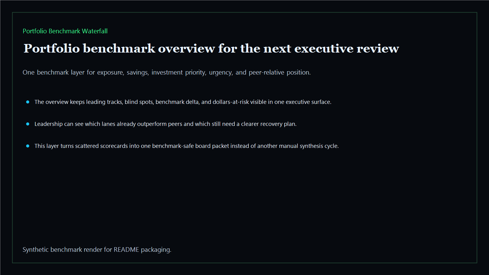
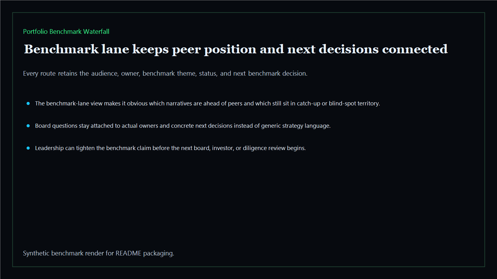
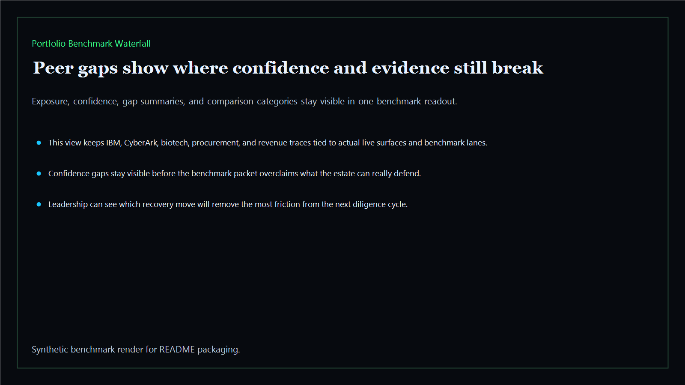
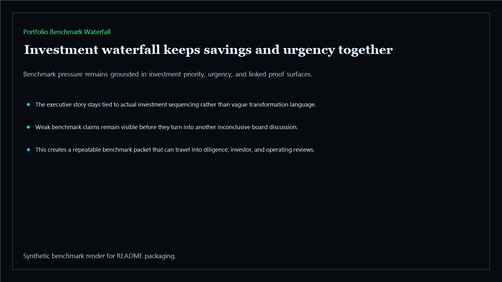

# Portfolio Benchmark Waterfall

Board-ready intelligence layer that ranks exposure, savings, investment priority, and peer-relative position across the Kinetic Gain estate.

- Live: `https://benchmark.kineticgain.com/`
- Repo: `mizcausevic-dev/portfolio-benchmark-waterfall`

## Why this matters

Leaders need more than isolated scorecards. They need one benchmark layer that shows where the company leads, where it lags, where money is still at risk, and what investment story survives a board or diligence room.

## What it includes

- TypeScript benchmark surface with peer-relative scoring and board-oriented routes
- synthetic executive lanes across AI, identity, revenue, FinTech, biotech, procurement, and public-sector readiness
- reusable benchmark outputs for exposure, savings, urgency, and investment sequencing
- prerendered static site, JSON payloads, screenshots, and docs

## Routes

- `/`
- `/benchmark-lane`
- `/peer-gaps`
- `/investment-waterfall`
- `/verification`
- `/docs`

## Local run

```bash
cd portfolio-benchmark-waterfall
npm install
npm run verify
npm run prerender
npm run render:assets
```

## CLI

```bash
npx portfolio-benchmark-waterfall fixtures/portfolio-benchmark-waterfall.json --format summary
npx portfolio-benchmark-waterfall fixtures/portfolio-benchmark-waterfall-clean.json --format json
```

## Docs

- [Architecture](docs/architecture.md)
- [Origin](docs/ORIGIN.md)
- [Kinetic Gain Embedded](docs/KINETIC_GAIN_EMBEDDED.md)

## Screenshots





